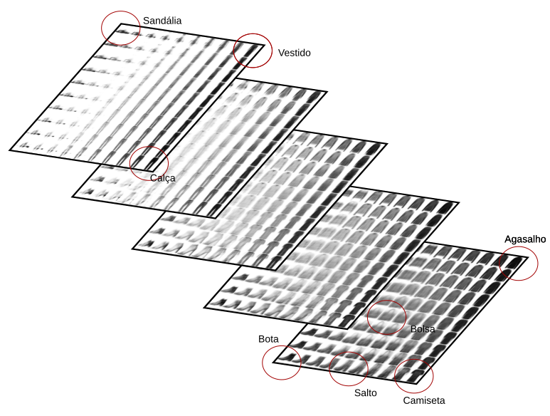

# Variational Autoencoder

The notebooks in this directory was trained with the fashion
mnist dataset and create a 2d or 3d space where specific points
represents the categories and intermediary points can generate
intermediary images.  

